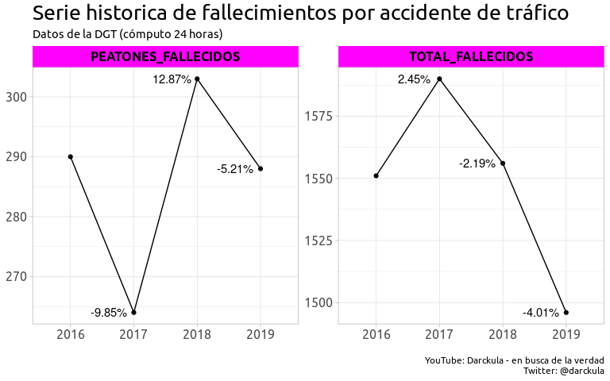
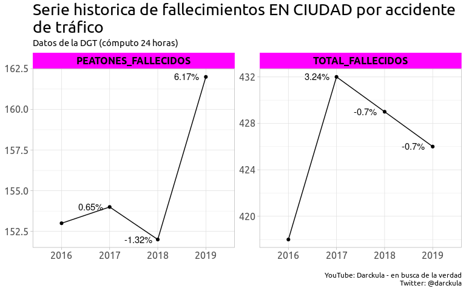
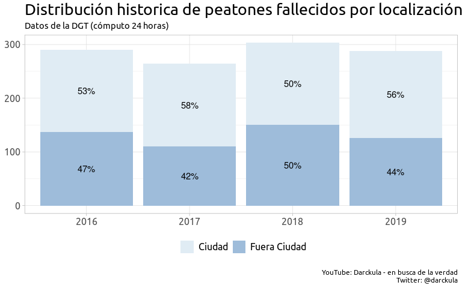
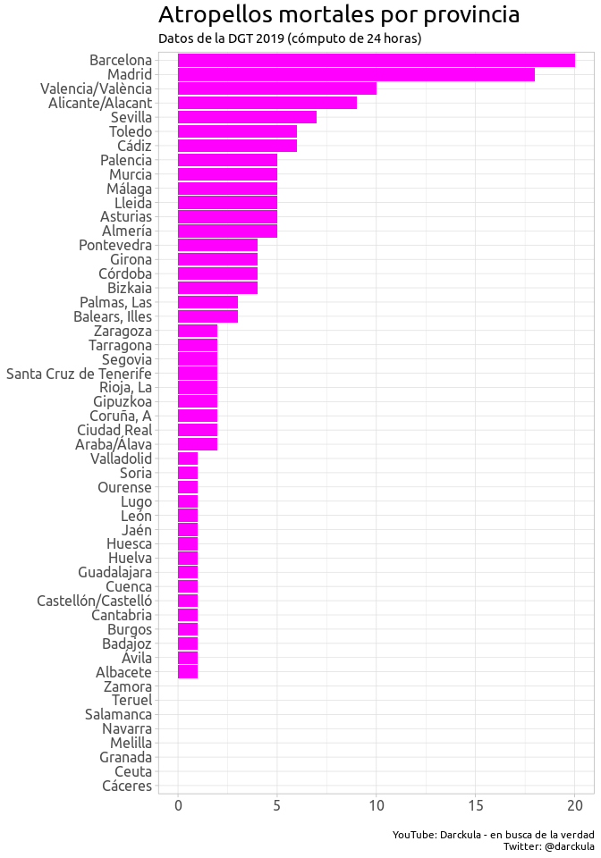

Nuevos límites de velocidad en España
================
2021-05-23

# Intro

El 11 Mayo 2021 ha entrado en vigor la nueva normativa de circulación
que limita la velocidad máxima de los vehiculos en ciudad. El límite
actual de 50 km/h se verá rebajado a 30km/h en el 80% de la calles de
nuestro pais.

Los nuevos limites serán:

-   50 km/h (sin cambios) para las calles de dos o más carriles para
    cada sentido de la circulación
-   30 km/h para las calles con un único carril de circulación para cada
    sentido
-   20 km/h si entre los vehiculos y los peatones no hay diferencia de
    altura, es decir, no hay una acera.

# Razones

Las razones que esgrime la DGT para llevar a cabo estas restricciones
son:

-   Reducir la mortalidad
-   Aumentar la calidad del aire
-   Reducir el ruido ambiental

Sin embargo, esto ya era posible hasta ahora dado que los aytos ya
tenian derecho para limitar la velocidad en determinadas calles, por
razones de seguridad o incluso ambientales.

## Reducir la mortalidad

<!-- -->

En 2019, 1496 personas perdieron la vida por un acc. de tráfico en
España. Esta cifra es la más baja desde 2016 y supone un descenso del
6.2% desde 2017 (hemos de aclarar que no tenemos datos anteriores y
tampoco la DGT ha publicado los datos 2020). Además, el número de
peatones atropellados mortalmente también sufrió un descenso en 2019 del
5.21%. Estos datos marcan, por tanto, una tendencia positiva en la lucha
contra la mortalidad en carretara.

<!-- -->

En cambio, el número de peatones que perdieron la vida por un atropello
en ciudad ascendio un 6% (10 personas) en 2019, llegando hasta los 162
fallecidos. Este incremento es usado por el gobierno para justificar la
reducción de los limites de velocidad en ciudad.

Pero, ¿qué hay de cierto en ello?

<!-- -->

Si los limites de velocidad se establecen para salvar vidas en ciudad,
quedarán excluidos de la protección de esta ley los peatones
atropellados fuera de la ciudad. Como vemos en el gráfico, los
atropellos mortales se distribuyen casi a partes iguales entre ciudad y
fuera de ciudad, con una ligera tendencia hacia la ciudad. Por tanto, el
primer problema que yo le encuentro a esta ley es que deja sin abordar
casi el otro 50% del problema: los atropellados, fuera de ciudad.

Centrandonos en los atropellos en vias urbanas, la DGT justificar la
reducción de la velocidad en base a la probabilidad de sufrir una lesión
grave o mortal:

-   50 km/h - 50%
-   30 km/h - 10%

Sin embargo, esto, además de ser pura teoría, pone el foco en evitar las
lesiones una vez producido el atropello. Si el atropello se produce a
menor a velocidad, hay una menor probabilidad de perecer. Pero esto es
un argumento peligroso porque presupone que los 162 peatones que
perdieron la vida en 2019, fueron atropellados por un vehículo a 50km/h.

No hay evidencia sustentada en los datos existentes que permitan
sostener que bajar los limites a 30km/h producirá automaticamente un
descenso de la mortalidad en las ciudades. Y de hecho, el objetivo a
conseguir sería el contrario: ser capaz de movernos más rápido por las
ciudades disminuyendo al mismo tiempo la mortalidad.

<!-- -->

Y como conseguimos eso?

-   Siendo mucho más inteligentes y estudiando la causa raíz de las
    colisiones y abordándolas para minimizarlas o erradicarlas. Por
    ejemplo, vemos en el gráfico que el 61% de los atropellos mortales
    tuvieron como causa raíz la infracción de peatón. No se puede eludir
    la responsablidad de peatón en este asunto, puesto que tiene un
    papel fundamental.

<!-- -->

-   Estudiando puntos calientes con una alta siniestralidad. La
    siniestralidad no es igual en todas la ciudades y en todas las
    calles de España.

## Factores mediamabientales

-   Contaminación:
    -   Mas atascos
    -   no esta claro que se contamine menos a 30 que ha 50
    -   vehiculos electricos (subvenciones y cargadores)
-   Ruido
    -   revoluciones del motor

# Oportunidades recaudatorias

# Conclusiones

-   No garantiza la reducción de la mortalidad en ciudad ni tampoco
    erradica los puntos calientes
-   Deja sin protección al 50% de los atropellados (fuera de ciudad)
-   No parece que vayan a disminuir los niveles de contaminación
    acústica y medio ambiental
-   Pero nos hace más lentos
-   Y brindará oportunidades recaudatorias a las administraciones
    pudiendo regar nuestras calles de radares.

En definitiva, es una ley que aplica la brocha gorda para un problema
que requiere precisión de cirujano.
